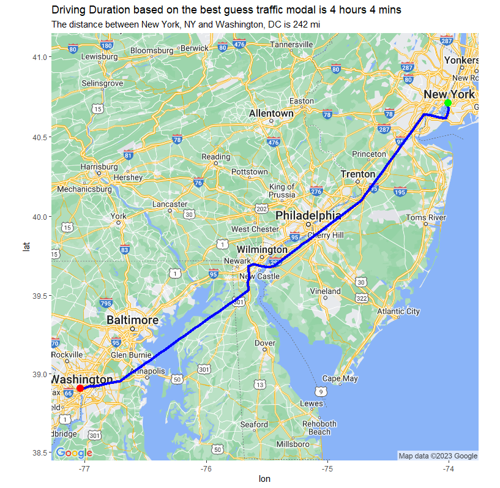

# RouteMapping-with-R
An R-based repository for calculating and visualizing travel distance, time, and routes between user-specified origin and destination addresses using Google Maps API.

## R Scripts Summary
This repository houses R scripts (Route_Shape_Traffic.R) designed to calculate and visualize the distance and travel time between a pair of origin and destination points. The travel data, including the route, is then plotted on a map.
Our scripts offer the flexibility of incorporating various factors into travel time calculations, such as traffic models (best guess, pessimistic, optimistic), the exact time of departure, and the mode of transportation (e.g., driving, transit, biking). The scripts leverage Google's API to provide this functionality.
In our provided example, we've set the origin as New York, NY, and the destination as Washington, DC.
You can kick-start the model inputs code as follows:
``` R 
#Modelinputs**********************************************************************************
# Set your Google Maps API key
api_key     <- "your Google Maps API key" # Replace with your Google Maps API key.
register_google(key = api_key)
# Example locations
origin      <- "New York, NY" # Replace with the origin address 
destination <- "Washington, DC" # Replace with the destination address.
mode        <- "driving"
departure_time <-  "now" # Use "now" to consider current traffic conditions
traffic_model  <- "best guess" #one of 'best_guess', 'pessimistic' or 'optimistic'
#********************************************************************************************
```
Following the execution of the script, you will be presented with a map visualizing the route and travel data, as demonstrated below:



Please note: Always remember to replace the API key, origin, and destination with your own data when trying this script.
## Google Maps API 
Get ready to experience the power of the Google Maps API! This script leverages the incredible capabilities of the Google Maps API and the user-friendly googleway library to perform routing and estimations.
By utilizing the google_directions() function, this script effortlessly conducts location searching,  routing calculations, providing accurate travel directions and estimations. It's like having a personal navigator right at your fingertips!
If you don't already have a Google Maps API, worry not! Obtaining a free API key is a breeze. Simply visit https://console.cloud.google.com and follow the instructions to get your hands on the API key. Oh, and don't forget to activate the "Direction API" in your Google Cloud portal for seamless functionality.
With the Google Maps API by your side, you'll unlock a world of possibilities for routing and estimations. Let's embark on this exciting journey and harness the power of location-based intelligence!
### Part of scripts with google_directions(): 
```R 
# Get the driving route from Google Maps Directions API, considering traffic conditions
route_data <- google_directions(
  origin = origin,
  destination = destination,
  key = api_key,
  mode = mode, # one of "driving", "walking", "bicycling", "transit"
  departure_time = departure_time, # Use "now" to consider current traffic conditions
  traffic_model  = traffic_model, #one of 'best_guess', 'pessimistic' or 'optimistic'
  units = c("imperial")
)
```
